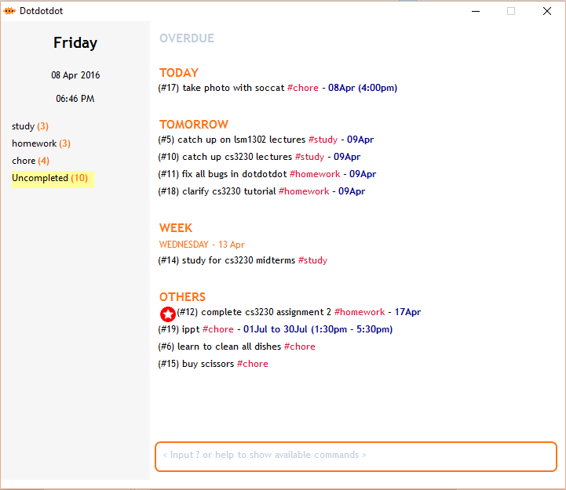

# Dotdotdot

The simple task manager by command line users, for command line users.

**Want to use Dotdotdot?**
* [Download the latest release](https://github.com/cs2103jan2016-f14-1j/releases)
* [**User Guide**](docs/User-Guide.md)
